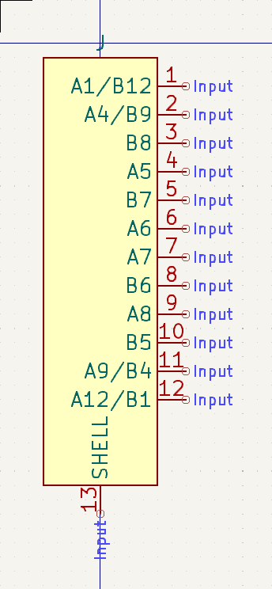
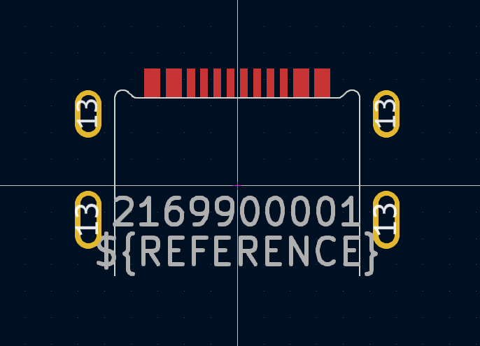
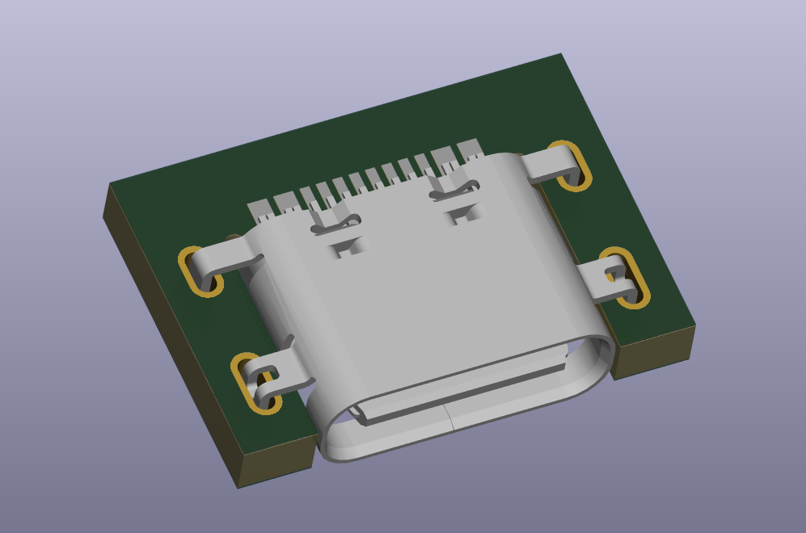

# KiCad library for Molex 2169900001

https://www.molex.com/en-us/products/part-detail/2169900001

```shell-session
$ make all
```

## Requirements

- `curl`
- `shasum` - from `perl`
- `pdftoppm` - from `poppler-utils`
- `convert` - from `imagemagick`
- `unzip`

```shell-session
$ sudo apt update && sudo apt install curl imagemagick perl poppler-utils unzip
```

## Gallery





